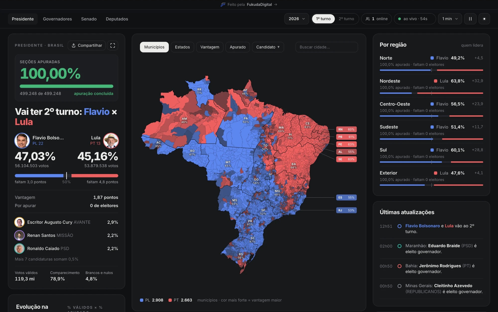
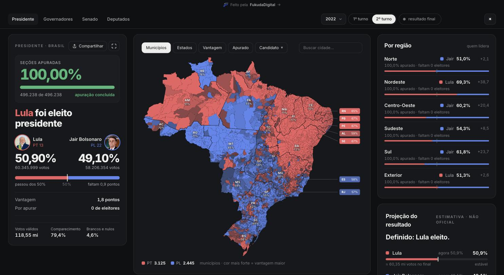
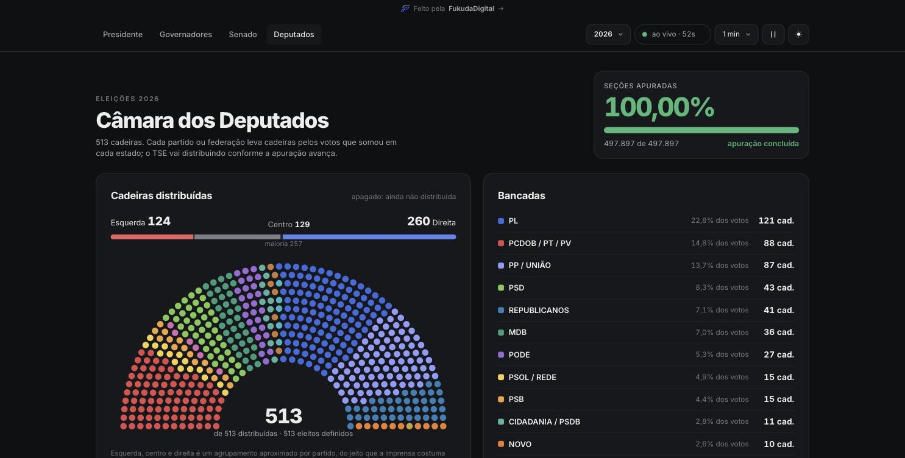
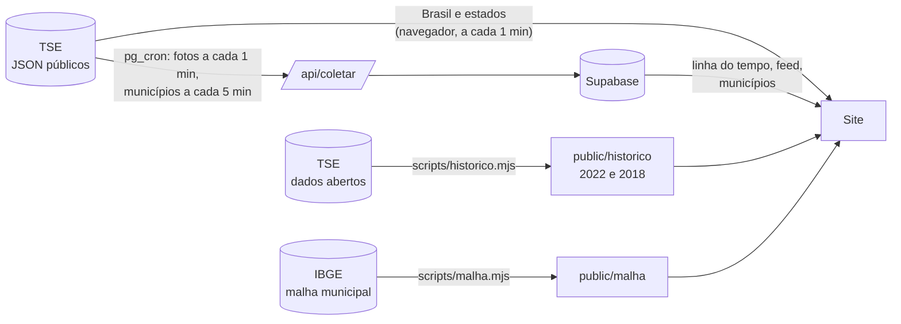

<div align="center">

# Apuração 2026

**A apuração das eleições brasileiras ao vivo, município por município.**

Presidente, governadores, Senado e Câmara, com dados oficiais do TSE e comparação com 2022 e 2018.

[**brazil-election-results-2026.vercel.app**](https://brazil-election-results-2026.vercel.app)

</div>



## O que tem

- **Mapa por município** dos 5.570 municípios, com modos de quem lidera, vantagem, % apurado e por candidato. Dá pra buscar uma cidade e ver o resultado dela no mapa.
- **Linha do tempo:** arrasta pra rever a apuração em qualquer momento da noite, ou aperta ▶ pra assistir do começo.
- **Últimas atualizações:** seções apuradas, presidente definido e governadores eleitos, conforme o TSE publica.
- **Governadores, Senado e Câmara:** situação de cada estado, hemiciclo das cadeiras, bancadas e os deputados mais votados do país.
- **2026, 2022 e 2018**, com 1º e 2º turno. O 2º turno de 2026 aparece sozinho quando o TSE começa a publicar.
- Atualização automática (1, 2 ou 5 min), contador de quem está online, tema claro e escuro, feito pra celular.

| Eleição de 2022, 2º turno                                                    | Câmara dos Deputados                                            |
| ---------------------------------------------------------------------------- | --------------------------------------------------------------- |
|  |  |

## Como os dados chegam

O TSE publica a apuração em arquivos JSON públicos (`resultados.tse.jus.br`), atualizados durante a contagem. É a mesma fonte que os portais de notícia usam. Não existe uma API melhor.



- **Brasil e estados:** o navegador de cada visitante lê direto do TSE. Se não conseguir, usa a rota `/api/tse`, com cache de 15s na Vercel.
- **Municípios, linha do tempo e feed:** um coletor roda no servidor, chamado pelo `pg_cron` do Supabase, e grava no banco. O visitante só lê essa cópia, e por isso o tráfego no TSE não cresce com a audiência.
- **Limite do TSE:** ele bloqueia por 10 min quem passa de 100 req/s. O coletor tem freio (25 req/s), para no primeiro bloqueio e não baixa de novo o município que já terminou de apurar.
- **2022 e 2018:** vêm dos CSVs do Portal de Dados Abertos do TSE. São convertidos uma vez para o mesmo formato JSON da divulgação ao vivo, então as telas são as mesmas. Os números foram conferidos com o resultado oficial.

## Estrutura

```
app/
  api/
    tse/[uf]          proxy de reserva pro TSE
    municipios/[uf]   municípios gravados pelo coletor
    historico         fotos da apuração + feed
    coletar           coletor (Brasil, estados, eventos), chamado pelo pg_cron
    coletar/municipios  coletor dos municípios
  creditos            créditos das fotos
  estados, senado, deputados
components/
  mapa/               mapa, camada de municípios, busca, tooltip e legenda
  estados/ senado/ deputados/
lib/
  eleicao.ts          códigos de cada eleição e URLs
  turno.ts            ano/turno escolhido (estado no navegador)
  arquivo.ts          download dos arquivos (TSE, proxy ou estático)
  tse.ts, cargos.ts   leitura dos arquivos de presidente e dos cargos estaduais
  servidor/           só roda no servidor: coletor, Supabase, freio do TSE
scripts/              geram malha, histórico e fotos (rodam uma vez)
supabase/migrations/  tabelas, RLS e agendamento do coletor
```

## Rodando local

```bash
npm install
npm run dev
```

Abre em http://localhost:3000. Sem Supabase configurado, o modo local baixa os municípios direto do TSE (com freio) e simula uma linha do tempo a partir do resultado final, só pra desenvolver.

### Variáveis de ambiente

| Variável                    | Pra quê                                                         |
| --------------------------- | --------------------------------------------------------------- |
| `NEXT_PUBLIC_SUPABASE_URL`  | URL do projeto Supabase                                         |
| `NEXT_PUBLIC_SUPABASE_KEY`  | chave pública (publishable/anon): leitura e contador de online  |
| `SUPABASE_SERVICE_ROLE_KEY` | chave secreta: só o coletor usa, pra gravar                     |
| `COLETOR_SEGREDO`           | segredo que o `pg_cron` manda no cabeçalho pra chamar o coletor |

### Supabase

Rode no SQL Editor, em ordem, os arquivos de `supabase/migrations/`. Antes, troque `SITE` e `SEGREDO` pela URL do site e pelo valor de `COLETOR_SEGREDO`.

### Scripts

| Comando                   | O que faz                                                                   |
| ------------------------- | --------------------------------------------------------------------------- |
| `npm run malha`           | gera os contornos dos municípios e estados a partir da malha do IBGE        |
| `npm run historico:fotos` | baixa as fotos dos candidatos de 2018 e 2022 (Wikimedia Commons)            |
| `npm run historico`       | converte os CSVs do TSE de 2018 e 2022 (baixa ≈1 GB pra `.cache/`, uma vez) |
| `npm run format`          | formata o código com Prettier                                               |

Os resultados já estão no repositório: os scripts só precisam rodar de novo se um ano for adicionado.

## Stack

Next.js 16 (App Router) · React 19 · TypeScript · Tailwind CSS 4 · Supabase (Postgres, pg_cron, pg_net) · Vercel

## Fontes

- Resultados: [TSE](https://resultados.tse.jus.br), arquivos públicos de divulgação e [Portal de Dados Abertos](https://dadosabertos.tse.jus.br)
- Mapa: [malha municipal do IBGE](https://servicodados.ibge.gov.br/api/docs/malhas)
- Fotos: TSE (2026) e Wikimedia Commons (2018 e 2022), com autor e licença na página [/creditos](https://brazil-election-results-2026.vercel.app/creditos)

Site independente, sem vínculo com o TSE. O resultado oficial é sempre o publicado pelo TSE.

---

<div align="center">

Feito pela [**FukudaDigital**](https://fukudadigital.com.br): automação, integrações e sites para empresas.

</div>
